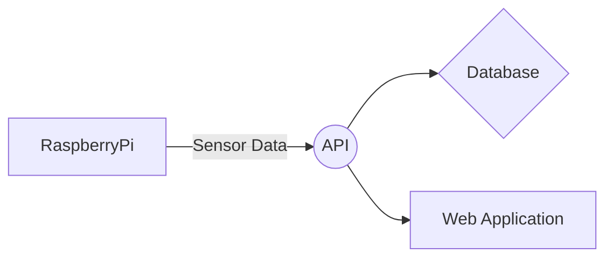

# AirQualityPi Sensors

> **Fork notice:** This is a fork of [Kingy/AirQualityPiSensors](https://github.com/Kingy/AirQualityPiSensors), modified to run on a **Raspberry Pi 3 B+** with **Raspberry Pi OS Trixie (Debian 13)**. Key changes include updated UART configuration for the Pi 3 B+ Bluetooth conflict, graceful sensor degradation, local SQLite data storage, a Streamlit dashboard, and a full pytest suite. The original project targets the Pi Zero 2 W and Pi 4 Model B.

This repository is part of the [AirQualityPi](https://airqualitypi.com) project. The script reads data from a PMS5003 particle sensor and a BME680 environmental sensor, then sends that data to the [AirQualityPiAPI](https://github.com/Kingy/AirQualityPiAPI).



## Hardware Compatibility

| Device | Status | Notes |
| --- | --- | --- |
| Raspberry Pi Zero 2 W | Supported | Previously tested |
| Raspberry Pi 4 Model B | Supported | Previously tested |
| Raspberry Pi 3 B+ | Supported | Use setup steps in this README |

## Wiring Summary

PMS5003 to Raspberry Pi:

- Pin #1 5V -> Pi Pin #2 5V
- Pin #2 GND -> Pi Pin #6 GND
- Pin #3 **TX** -> Pi Pin **#10** GPIO 15 **(RXD)** — sensor transmits → Pi receives
- Pin #4 **RX** -> Pi Pin **#8** GPIO 14 **(TXD)** — sensor receives ← Pi transmits
- Pin #5 RESET -> Pi Pin **#13** GPIO **27**
- Pin #6 EN -> Optional (script defaults to GPIO 22)

> **Note:** TX and RX labels describe the sensor's own pins. TX (transmit) must connect to the Pi's RX pin, and RX (receive) must connect to the Pi's TX pin. Do not connect TX→TX or RX→RX.

BME680 to Raspberry Pi:

- Pin #1 VIN -> Pi Pin #1 3.3V
- Pin #2 SDA -> Pi Pin #3 GPIO 2 SDA
- Pin #3 SCL -> Pi Pin #5 GPIO 3 SCL
- Pin #5 GND -> Pi Pin #9 GND

## Raspberry Pi 3 B+ Setup (Raspberry Pi OS Trixie)

1. Enable interfaces:

```bash
sudo raspi-config
```

- Interface Options -> I2C -> Enable
- Interface Options -> Serial Port -> Disable login shell, enable serial hardware

2. Configure UART and I2C in `/boot/firmware/config.txt`:

```ini
enable_uart=1
dtoverlay=disable-bt
dtparam=i2c_arm=on
```

> **Trixie note:** The config file is at `/boot/firmware/config.txt` — the old path `/boot/config.txt` no longer exists on Trixie.

> **Important:** Use `dtoverlay=disable-bt` (disables Bluetooth entirely, frees the hardware UART for the PMS5003). Do **not** use `miniuart-bt` or `pi3-miniuart-bt`. If either of those lines is already present in the file, **remove them** before adding `disable-bt` — having both is contradictory and will produce boot warnings.

3. Reboot:

```bash
sudo reboot
```

4. Validate devices after reboot:

```bash
ls -l /dev/serial0
sudo i2cdetect -y 1
```

You should see BME680 at `0x76` or `0x77` in the I2C scan.

5. Install OS packages required for builds and diagnostics:

```bash
sudo apt update
sudo apt install -y build-essential git i2c-tools python3-dev python3-setuptools python3-venv python3-serial libgpiod3 libgpiod-dev gpiod sqlite3
```

> **Trixie note:** `libgpiod3` (not `libgpiod2`) and `libgpiod-dev` are required on Trixie so the Python `gpiod` package can compile correctly. Without them the PMS5003 sensor driver will fail to import.

6. Add your user to the required groups:

```bash
sudo usermod -a -G dialout pi
sudo usermod -a -G gpio pi
sudo reboot
```

Without these, the script will fail with "permission denied" errors on the serial port and GPIO pins. The group changes take effect after the reboot.

## Installation

See **[INSTALL_UPDATE.md](INSTALL_UPDATE.md)** for full step-by-step instructions, including Pi 3 B+ hardware setup, Python environment setup, and systemd service deployment. This replaces the original `INSTALL.md` with corrected wiring, Trixie-specific package requirements, and additional sections on database access and safe shutdown.

## Environment Variables

| Variable | Required | Default | Description |
| --- | --- | --- | --- |
| `API_ENDPOINT` | No | None | Base URL for AirQualityPiAPI. If not set, readings are saved locally and API posts are skipped. |
| `REQUEST_TIMEOUT` | No | `10` | HTTP request timeout in seconds |
| `PMS_DEVICE` | No | `/dev/serial0` | PMS5003 serial device |
| `PMS_PIN_ENABLE` | No | `22` | GPIO pin for PMS enable |
| `PMS_PIN_RESET` | No | `27` | GPIO pin for PMS reset |
| `I2C_ADDR` | No | `0x77` | BME680 address (`0x76` or `0x77`) |
| `BME_I2C_BUS` | No | `1` | I2C bus number |
| `SEA_LEVEL_PRESSURE` | No | `1002.25` | Local sea-level pressure for altitude calculations |

## Run Manually

```bash
python Sensors.py
```

Behavior notes:

- If one sensor is unavailable, the script continues with the other sensor.
- API send calls are skipped if `API_ENDPOINT` is missing.
- Errors are written to `error.log` in the project root.

## Recommended Scheduling: systemd Timer

This repository includes templates in `deploy/systemd/`.

Copy them to systemd:

```bash
sudo cp deploy/systemd/airqualitypi-sensors.service /etc/systemd/system/
sudo cp deploy/systemd/airqualitypi-sensors.timer /etc/systemd/system/
```

Update `WorkingDirectory`, `EnvironmentFile`, and `ExecStart` paths in `/etc/systemd/system/airqualitypi-sensors.service` if your install path differs from `/home/pi/AirQualityPiSensors`.

Enable and start:

```bash
sudo systemctl daemon-reload
sudo systemctl enable --now airqualitypi-sensors.timer
sudo systemctl status airqualitypi-sensors.timer
```

Check recent logs:

```bash
journalctl -u airqualitypi-sensors.service -n 50 --no-pager
```

## Dashboard

The dashboard reads from the local `readings.db` SQLite file written by `Sensors.py` and displays live charts for particulate matter, temperature, humidity, and pressure.

### Deploy the dashboard service

Copy the template and enable it:

```bash
sudo cp deploy/systemd/airqualitypi-dashboard.service /etc/systemd/system/
sudo systemctl daemon-reload
sudo systemctl enable --now airqualitypi-dashboard.service
sudo systemctl status airqualitypi-dashboard.service
```

The dashboard will be available at `http://<pi-ip>:8501` from any device on the same network.

The dashboard includes an **auto-refresh slider** (10–300 seconds) in the sidebar — set it before your presentation and the page will refresh automatically without any interaction.

Check logs:

```bash
journalctl -u airqualitypi-dashboard.service -n 50 --no-pager
```

### Run manually (development)

```bash
streamlit run dashboard.py --server.port 8501 --server.address 0.0.0.0
```

### Log rotation

`error.log` grows indefinitely. To rotate it weekly, create `/etc/logrotate.d/airqualitypi`:

```
/home/pi/AirQualityPiSensors/error.log {
    weekly
    rotate 4
    compress
    missingok
    notifempty
}
```

## Cron Fallback

If you prefer cron, use:

```cron
*/15 * * * * cd /path/to/AirQualityPiSensors && /path/to/AirQualityPiSensors/.venv/bin/python Sensors.py >> /path/to/AirQualityPiSensors/error.log 2>&1
```

## Troubleshooting

- No PMS data:
    - Confirm serial device exists: `ls -l /dev/serial0` — should show `-> ttyAMA0`. If it shows `-> ttyS0`, the `disable-bt` overlay is not applied.
    - Confirm serial login shell is disabled in `raspi-config`
    - Check TX/RX wiring — sensor TX must go to Pi RX (Pin 10), not Pin 8
- No BME680 data:
    - Confirm wiring and run `sudo i2cdetect -y 1`
    - Confirm `.env` uses the detected `I2C_ADDR`
- `ImportError: cannot import name '_gpiod'` or similar gpiod error:
    - Run `sudo apt install libgpiod3 libgpiod-dev` then `pip install gpiod --force-reinstall` inside the venv
- `Permission denied` on `/dev/ttyAMA0` or GPIO pins:
    - Run `groups` and confirm `dialout` and `gpio` are listed
    - If not, run `sudo usermod -a -G dialout pi` and `sudo usermod -a -G gpio pi`, then reboot
- API send failures:
    - Check `API_ENDPOINT` in `.env`
    - Verify network access from Pi to API host
    - Increase `REQUEST_TIMEOUT` if network is slow

For full hardware background and project context, see [project.md](project.md).


