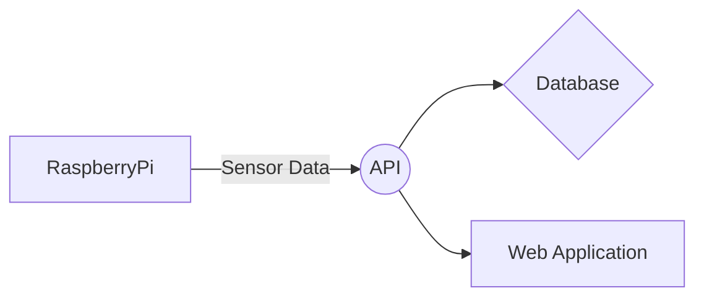

# AirQualityPi Sensors

> **Fork notice:** This is a fork of [Kingy/AirQualityPiSensors](https://github.com/Kingy/AirQualityPiSensors), modified to run on a **Raspberry Pi 3 B+** with Raspbian (installed via NOOBS). Key changes include updated UART configuration for the Pi 3 B+ Bluetooth conflict, graceful sensor degradation, local SQLite data storage, a Streamlit dashboard, and a full pytest suite. The original project targets the Pi Zero 2 W and Pi 4 Model B.

This repository is part of the [AirQualityPi](https://airqualitypi.com) project. The script reads data from a PMS5003 particle sensor and a BME680 environmental sensor, then sends that data to the [AirQualityPiAPI](https://github.com/Kingy/AirQualityPiAPI).



## Hardware Compatibility

| Device | Status | Notes |
| --- | --- | --- |
| Raspberry Pi Zero 2 W | Supported | Previously tested |
| Raspberry Pi 4 Model B | Supported | Previously tested |
| Raspberry Pi 3 B+ | Supported | Use setup steps in this README |

## Wiring Summary

PMS5003 to Raspberry Pi:

- Pin #1 5V -> Pi Pin #2 5V
- Pin #2 GND -> Pi Pin #6 GND
- Pin #3 TX -> Pi Pin #8 GPIO 14 (TXD)
- Pin #4 RX -> Pi Pin #10 GPIO 15 (RXD)
- Pin #5 RESET -> Pi Pin #11 GPIO 17
- Pin #6 EN -> Optional (script defaults to GPIO 22)

BME680 to Raspberry Pi:

- Pin #1 VIN -> Pi Pin #1 3.3V
- Pin #2 SDA -> Pi Pin #3 GPIO 2 SDA
- Pin #3 SCL -> Pi Pin #5 GPIO 3 SCL
- Pin #5 GND -> Pi Pin #9 GND

## Raspberry Pi 3 B+ Setup (Raspbian via NOOBS)

1. Enable interfaces:

```bash
sudo raspi-config
```

- Interface Options -> I2C -> Enable
- Interface Options -> Serial Port -> Disable login shell, enable serial hardware

2. Configure UART and I2C in `/boot/config.txt`:

```ini
enable_uart=1
dtoverlay=miniuart-bt
dtparam=i2c_arm=on
```

3. Reboot:

```bash
sudo reboot
```

4. Validate devices after reboot:

```bash
ls -l /dev/serial0
sudo i2cdetect -y 1
```

You should see BME680 at `0x76` or `0x77` in the I2C scan.

5. Install OS packages required for builds and diagnostics:

```bash
sudo apt update
sudo apt install -y build-essential git i2c-tools python3-dev python3-setuptools python3-venv python3-serial
```

## Installation

See **[INSTALL.md](INSTALL.md)** for full step-by-step instructions, including Pi 3 B+ hardware setup, Python environment setup, and systemd service deployment.

## Environment Variables

| Variable | Required | Default | Description |
| --- | --- | --- | --- |
| `API_ENDPOINT` | Yes | None | Base URL for AirQualityPiAPI |
| `REQUEST_TIMEOUT` | No | `10` | HTTP request timeout in seconds |
| `PMS_DEVICE` | No | `/dev/serial0` | PMS5003 serial device |
| `PMS_PIN_ENABLE` | No | `22` | GPIO pin for PMS enable |
| `PMS_PIN_RESET` | No | `27` | GPIO pin for PMS reset |
| `I2C_ADDR` | No | `0x77` | BME680 address (`0x76` or `0x77`) |
| `BME_I2C_BUS` | No | `1` | I2C bus number |
| `SEA_LEVEL_PRESSURE` | No | `1002.25` | Local sea-level pressure for altitude calculations |

## Run Manually

```bash
python Sensors.py
```

Behavior notes:

- If one sensor is unavailable, the script continues with the other sensor.
- API send calls are skipped if `API_ENDPOINT` is missing.
- Errors are written to `error.log` in the project root.

## Recommended Scheduling: systemd Timer

This repository includes templates in `deploy/systemd/`.

Copy them to systemd:

```bash
sudo cp deploy/systemd/airqualitypi-sensors.service /etc/systemd/system/
sudo cp deploy/systemd/airqualitypi-sensors.timer /etc/systemd/system/
```

Update `WorkingDirectory`, `EnvironmentFile`, and `ExecStart` paths in `/etc/systemd/system/airqualitypi-sensors.service` if your install path differs from `/home/pi/AirQualityPiSensors`.

Enable and start:

```bash
sudo systemctl daemon-reload
sudo systemctl enable --now airqualitypi-sensors.timer
sudo systemctl status airqualitypi-sensors.timer
```

Check recent logs:

```bash
journalctl -u airqualitypi-sensors.service -n 50 --no-pager
```

## Dashboard

The dashboard reads from the local `readings.db` SQLite file written by `Sensors.py` and displays live charts for particulate matter, temperature, humidity, and pressure.

### Deploy the dashboard service

Copy the template and enable it:

```bash
sudo cp deploy/systemd/airqualitypi-dashboard.service /etc/systemd/system/
sudo systemctl daemon-reload
sudo systemctl enable --now airqualitypi-dashboard.service
sudo systemctl status airqualitypi-dashboard.service
```

The dashboard will be available at `http://<pi-ip>:8501` from any device on the same network.

Check logs:

```bash
journalctl -u airqualitypi-dashboard.service -n 50 --no-pager
```

### Run manually (development)

```bash
streamlit run dashboard.py --server.port 8501 --server.address 0.0.0.0
```

### Log rotation

`error.log` grows indefinitely. To rotate it weekly, create `/etc/logrotate.d/airqualitypi`:

```
/home/pi/AirQualityPiSensors/error.log {
    weekly
    rotate 4
    compress
    missingok
    notifempty
}
```

## Cron Fallback

If you prefer cron, use:

```cron
*/15 * * * * cd /path/to/AirQualityPiSensors && /path/to/AirQualityPiSensors/.venv/bin/python Sensors.py >> /path/to/AirQualityPiSensors/error.log 2>&1
```

## Troubleshooting

- No PMS data:
    - Confirm serial device exists: `ls -l /dev/serial0`
    - Confirm serial login shell is disabled in `raspi-config`
- No BME680 data:
    - Confirm wiring and run `sudo i2cdetect -y 1`
    - Confirm `.env` uses the detected `I2C_ADDR`
- API send failures:
    - Check `API_ENDPOINT` in `.env`
    - Verify network access from Pi to API host
    - Increase `REQUEST_TIMEOUT` if network is slow

For full hardware background and project context, see [project.md](project.md).


